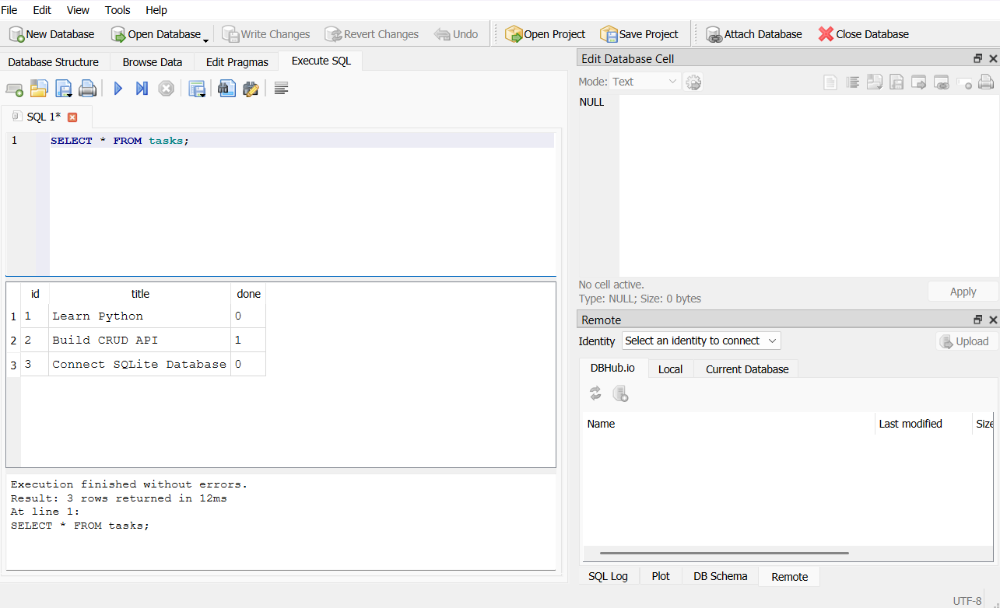

# Task API

A RESTful Task Management API built with **FastAPI** and **SQLite**. The API supports creating, reading, updating, and deleting tasks while storing data in a persistent SQLite database.

## Features

- Create tasks
- View all tasks
- View a task by ID
- Update tasks
- Delete tasks
- Persistent data storage using SQLite

## Why SQLite?

SQLite was chosen because it is:

- Lightweight and serverless
- Built into Python (`sqlite3` module)
- Easy to set up with no additional database server
- Ideal for small projects, learning SQL, and local development

## Database Location

The SQLite database is stored in the project root as:

```
tasks.db
```

The database file is created automatically the first time the application is run.

## Project Structure

```
project/
│
├── main.py
├── database.py
├── tasks.db
├── requirements.txt
└── README.md
```

## Installation

1. Clone the repository.

```bash
git clone <your-repository-url>
```

2. Move into the project directory.

```bash
cd <your-project-folder>
```

3. Create a virtual environment.

**Windows**

```bash
python -m venv venv
venv\Scripts\activate
```

4. Install dependencies.

```bash
pip install -r requirements.txt
```

## Running the Project

Start the FastAPI server using:

```bash
uvicorn main:app --reload
```

The API will be available at:

```
http://127.0.0.1:8000
```

Swagger documentation:

```
http://127.0.0.1:8000/docs
```

## Automatic Database Creation

When the project starts for the first time:

- `tasks.db` is created automatically.
- The `tasks` table is created if it does not exist.
- Three sample tasks are inserted only if the table is empty.

No manual database setup is required.

## Example SQL Query

The following SQL query was executed during development:

```sql
SELECT * FROM tasks;
```

This query returns every task stored in the database.

## Database Screenshot

Insert a screenshot of your SQLite database viewer here.

Example:

```
images/sqlite-viewer.png
```

Then display it:

```markdown

```