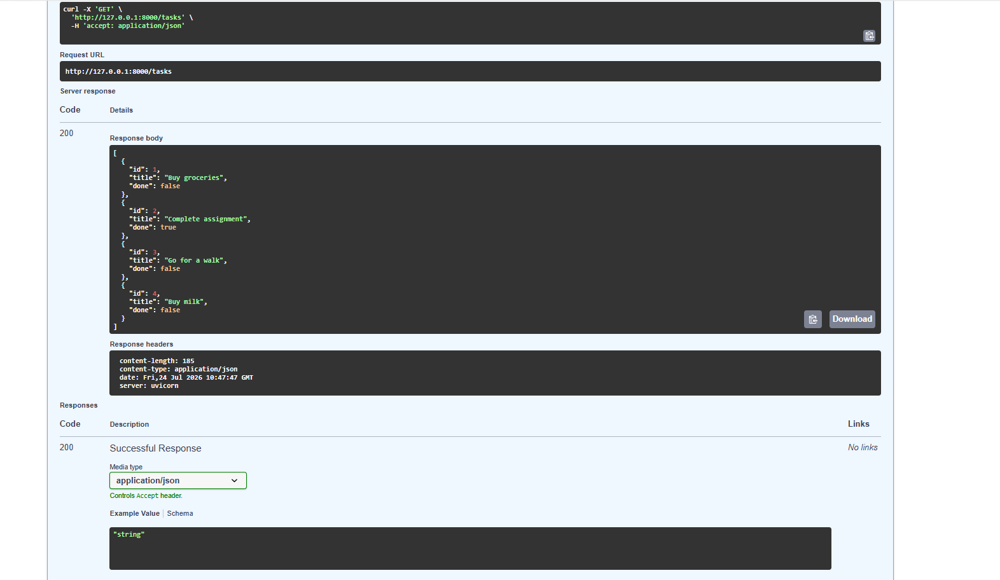
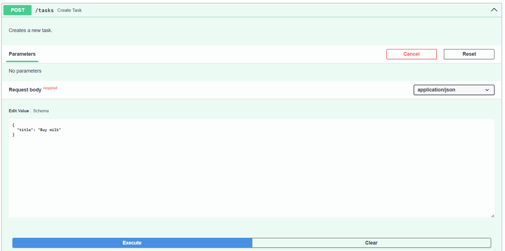

# Task API

A simple RESTful Task API built with FastAPI. It demonstrates CRUD (Create, Read, Update, Delete) operations using an in-memory list. The API also includes automatically generated Swagger UI documentation.

---

## Installation

### Clone the repository

```bash
git clone https://github.com/Fatima-26-23/task-api.git
cd task-api
```

### Install dependencies

```bash
pip install fastapi uvicorn
```

### Run the API

```bash
fastapi dev main.py
```

Open the API documentation:

```
http://127.0.0.1:8000/docs
```

---

## API Endpoints

| Method | Endpoint | Description |
|---------|----------|-------------|
| GET | / | API information |
| GET | /health | Health check |
| GET | /tasks | Get all tasks |
| GET | /tasks/{id} | Get a task by ID |
| POST | /tasks | Create a new task |
| PUT | /tasks/{id} | Update a task |
| DELETE | /tasks/{id} | Delete a task |

---

## Example curl Output

Request:

```bash
curl -i http://127.0.0.1:8000/tasks/1
```

Example Response:

```text
HTTP/1.1 200 OK
content-type: application/json

{"id":1,"title":"Buy groceries","done":false}
```

---

## Swagger UI

Swagger UI is available at:

```
http://127.0.0.1:8000/docs
```

### Screenshot

## Swagger UI

### GET /tasks



### POST /tasks

