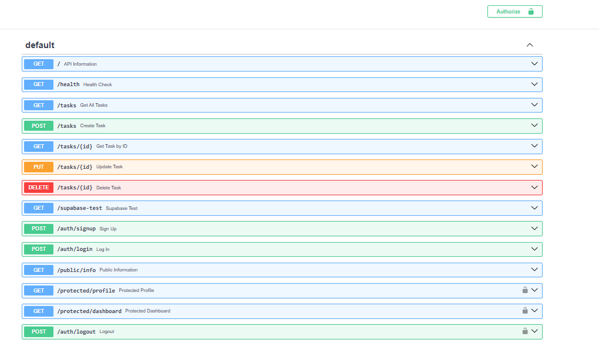

# Task API with Authentication

A RESTful Task API built with FastAPI.

## Features

- CRUD operations for tasks
- SQLite database
- User authentication using Supabase
- JWT protected routes
- Swagger UI documentation
- Bearer Authentication

## Technologies

- Python
- FastAPI
- SQLite
- Supabase Authentication
- Swagger UI

## Installation

### Clone the repository

```bash
git clone https://github.com/Fatima-26-23/task-api.git
cd task-api
```

### Install dependencies

```bash
pip install -r requirements.txt
```

### Create a .env file

Copy `.env.example` and replace the placeholders.

```env
SUPABASE_URL=your_project_url
SUPABASE_KEY=your_supabase_anon_key
```

### Run

```bash
python -m uvicorn main:app --reload
```

Open:

```
http://127.0.0.1:8000/docs
```

---

## API Reference

| Endpoint | Method | Authentication |
|----------|--------|----------------|
| / | GET | Public |
| /health | GET | Public |
| /tasks | GET | Public |
| /tasks/{id} | GET | Public |
| /tasks | POST | Public |
| /tasks/{id} | PUT | Public |
| /tasks/{id} | DELETE | Public |
| /auth/signup | POST | Public |
| /auth/login | POST | Public |
| /public/info | GET | Public |
| /protected/profile | GET | Bearer Token |
| /protected/dashboard | GET | Bearer Token |
| /auth/logout | POST | Bearer Token |

---

## Swagger UI

Open:

```
http://127.0.0.1:8000/docs
```

Authenticate using the **Authorize** button with your JWT access token.

## Swagger UI

